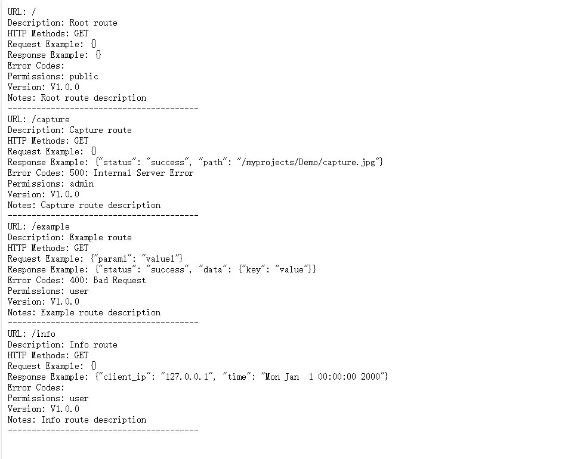

# 项目预览

## linux下运行

```bash
bash start.sh
```

## windows下运行

直接启动运行程序即可

## 默认ip和端口

- Ip :0.0.0.0
- Port: 8081

## 获得路由支持

**打开http://127.0.0.1:8081/** ,你会注意到浏览器中的欢迎信息

此时,访问info路由，即

**打开http://127.0.0.1:8081/info** ,你可以看到当前的用户IP信息和时间

*如果要获取帮助文档* ,请你

**打开http://127.0.0.1:8081/help** ,里面有详细的帮助介绍

帮助文档是在路由建立的时候就注册信息的，结构体定义如下

```cpp
struct HelpDoc {
    std::string url;
    std::vector<std::string> paramList;
    std::string description;
    std::vector<std::string> httpMethods; // 支持的 HTTP 方法
    std::string requestExample;           // 请求示例
    std::string responseExample;          // 响应示例
    std::map<int, std::string> errorCodes;// 错误码和描述
    std::string permissions;              // 权限要求
    std::string version;                  // 版本信息
    std::string notes;                    // 备注
};
```

